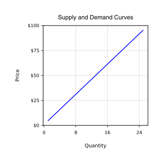
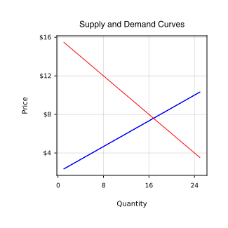
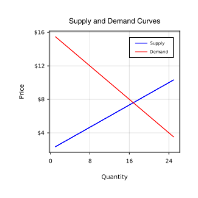
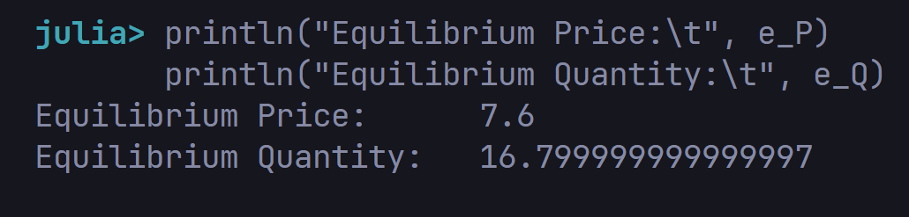
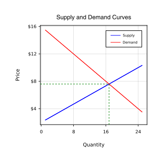

# Chapter: Analysis of Business

## Introduction
In this lecture, we will start by stepping back to get an overview of Analysis. After that, we will sharpen our analytic skills by using some real world, business applications. Along the way, we will continue to add to our visualization toolkit by learning how to use **CairoMakie, which is the premium backend to the Makie plotting package.

## What is Analysis
The English word *"Analysis"* comes from the Ancient Greek word meaning "a breaking up". The origin of the word is very appropriate. Wikidepia defines Analysis as 
> *"The process of breaking a complex topic or substance, into smaller parts, in order to gain a better understanding of it."*

The history of analysis as a human activity goes back to Ancient times, while the modern, formal concept of analysis has been ascribed to Alhezen, Descartes, Galileo and Newton. While the history of analysis is rooted in Math and Science, in practice, analysis is used in many different fields, ranging from Music and Literature, to Philosophy and Psychotherapy. It is used in the Public Sector to set Public Policy and to acquire Security Intelligence. It is used in the Private Sector to bring a more disciplined approach to Business and Economics.

While analysis is often associated with Math and Science, it is important to understand that analysis is a general process that is independent of domain. With respect, lawyers are not known for their Math and Science skills. And yet, lawyers, often turn out to be excellent analysts, because their profession requires the use of logical thinking to dispassionately examine the evidence, in order to formulate an argument, or an opinion. The objective of their process is not about finding the correct answers to a problem set. Their objective is to convince a judge or jury, to a particular point of view, based upon the evidence presented. This process is similar to the one used by analysts.
While the use of computers may allow the analyst to tackle more complex cases, it is important to understand that, at its core, analysis is an ancient, human activity that we have been using for thousands of years to help us understand the world around us. 

Let's take a break from the Ivory Tower and take a look at a couple of real world examples of how analysis is used in the business world. In the first example, we will take a look at the classic Microeconomics model of Supply and Demand, in order to gain a better understand of the market behaviors of Companies and Consumers. In the second example, we will create a Mortgage Calculator, in order to better understand how fixed-rate loans work in the US. We know that sounds really boring, but I promise, that it will be fascinating.

## Supply and Demand
According to Wikipedia: 
> [!TIPS]
> *"In microeconomics, Supply and Demand is an economic model of price determination in a market. It postulates that... in a competitive market, the unit price for a particular good... will vary until it settles at a point where the quantity demanded... will equal the quantity supplied... resulting in an economic equilibrium for price and quantity transacted."*

Did any of that make sense to you?  It might be easier to see on a diagram. 


In microeconomics, the standard graphical representation of Supply and Demand is plotting on a chart showing the relationship between Price and Quantity, with Price on the vertical axis and Quantity on the horizontal axis. Consumer behaviorn is represented by a Demand Curve. At a high price, the quantity demanded is low, since the preception of Consumers is that they are getting repped off at the high price.  At a low price, the quantity demanded is high, since the Consumers perception is that they are getting a great deal at a low price. So, without knowing anything about economics, common sense would tell you that the Demand Curve is a downwrd sloping curve on this diagram.


On the flip side, Company behavior is represented by a Supply Curve. At a low price, the quantity that the Company is willing to supply is low, since the Company does not have enough of a profit incentive to sell their product at a low price. At a high price, the quantity that the Company is willing to supply is high, since the Company now has a large profit incentive to sell as much product as possible at that high price. Again, without knowing anything about Economics, common sense would tell you that the Supply Curve is an upward sloping curve on this diagram.


The intersection of these two curves, is what economists refer to, as the economic equilibrium price and quantity. In theory, at this price, the Company will sell all of their products, and will not have any excess inventory, nor will they have any backorders. Let's use the examples provided in the Wikipedia article to see if we can use Julia to deternime the equilibrium Price and Quantity.

### Supply
In the Wikidepia example, the formula for the Supply Curve is 

$Q(P)=3P-6,$

where $Q$ is Quantity and $P$ is Price. Let's plut in a value of $5\$$ for the Price to see the resulting Quantity. 

[Q(P)=3P-6](../Business/images/Q(P)_10.png)

So, just based on these $2$ Price points, you can see that, as the Price increases, the Quantity increases as well. This confirms our intuition that the Supply Curve is an upward sloping curve. Now, let's do the same thing for the Demand Curve. In the Wikipedia example, the formula for the Demand Curve is $Q(P)=32-2P$.

[Q(P)=32-2P](../Business/images/Q(P)_32-2P.png)

So, just based on these 2 Price points, you can see that, as the Price increases the Quantity decreases. This also confirms our intuition that the Demand Curve is a downward sloping curve. We can continue plugging in numbers, but it would be more helpful if we could see the Supply and Demand Curves on a plot. Let's use the CairoMakie to generate these plots

## Makie packages
We use the following packages:
* Mackie@0.12.0;
* GLMakie@0.1.25;
* CairoMakie@0.3.12.

Makie is a plotting package created by Simon Danisch. Most of the other plotting packages available in Julia were originally written in other programming languages, so they are  not necessarily optimized for Julia. Makie was written from the ground-up using  Julia. It has some amazing capabilities, but it is still very new, so it is evolving rapidly. Admittedly, it is not the easiest plotting package to learn, but it has tremendous potential, so it is a good one to have available in your analysis toolkit. 

MakieLayout was a companion package to Makie that was created by Julius Krumbiegel. Initially, it was a separate package that added some powerful layout features to Makie, but it has since been integrated into Makie. This integration just happened recently, so the version of Makie that we will be using is actually different than the one that we used during our first lecture just a few months ago. 

Plotting packages have a frontend and a backend. The frontend is the part tha the user interacts with in order to enter the plot specifications. The backend is how those specifications are displayed on your monitor. During our first lectures, we used the default beckend to Makie called  GLMakie, which we never even mentioned in our lectures because it is used by Makie by default. In this lecture, we will be using another Makie backend called CairoMakie. 

CairoMakie is a Makie backend that is capable of generating publication quality vector graphics. The name Makie comes from the Japanese lacquer decoration technique. We will not attempt the Japanese pronunciation, but here are a couple of examples from the internet [makie pronunciation](https://forvo.com/word/maki-e/). In the US, we would pronounce this as "Maki-e". However, Simon Danisch pronounces it Makie, so we will go with his pronounciation, since it is his package. Now, back to our example...

### Supply and demand Functions
For both the Supply Curve and the Demand Curve, Economists define Quantity as a function of Price, meaning that Price is the independent variable, while Qunatity is the dependent variable. In Math, the convention would be to plot Price on the $x$-axis and Quantity on the $y$-axis, since the Independent variable is typically plotted on the $x$-axis in Math. However, in microeconomics, the axes are switched due to historic conventions, which can be confusing, if you are not aware of the historic context.

When plotting functions, Makie follwo the Math convention, so it is expecting the Independent variable to be plotted on the $x$-axis, so that it can return the Dependent variable to plot along the $y$-axis. That means that we need to reconfigure the Supply and Demand Functions to follow the Math convention and not the Microeconomics convention.  In order to have Qunatity plot on the $x$-axis and Price plot on the $y$-axis, we need to express Price as a Function of Quantity, and not the other way around. Doing some simple math, the Supply Curve will look this this
```
P_supply(Q) = (Q + 6) / 3

P_demand(Q) = (-Q + 32) / 2

```
### Visualize Curves
Now, we are ready to generate a plot. You may have to adjust the resolution dimensions to match your screen resolution. On our monitor, the empty plot sits nicely in our Plots Panel. The *"scene"* variable is the name of the overall plot that we are generating. As its name suggests, the *"layout"* variable contains the plot layout elements that sit on top of the *"scene"* layer. We know that this may be a little confusing at this point, but it should become clearer as we continue going through this example.



You should now see the Supply Curve on the plot as an upward sloping blue line. Notice when calling the lines-bang Function, we are plotting onto the "axis" which sits on the "scen", so there are 3 layers now, a Scene, a Layout and now a Plot. The intermediate Layout layer is what allows us to costomize the Titles and Labels easily without disturbing the actual Plot.



You should now see the Demand Curve on the plot as a downward sloping red line. Let's add a Legend to our plot.



Adding a Legend is surprisingly verbose. That is because creating a Legend is like generating a mini-plot on top of another plot. All of those attributes can be customized to fit your needs. Rather than me going through all of the attributes to explain them, it is best for your to play around with the settings to see what changes, so that you can choose the settings that you like. 

Although there is a lot of code here, the good news is that once you find the settings that you like, you can simply copy and paste this code to any future plot.  Now that we have s Supply and Demand plot, we need to find the equilibrium price and quantity which is at the intersection of the Supply and Demand Curves.  Just by looking at the plot, it looks like the equilibrium price is around 7 or 8 dollars, and the equilibrium quantity is around 17 units. 

If we want toi find the exact coordinates, then we need to use Linear Algebra. However, before we can use Linear Algebra, we need to reconfigure the Supply and Demand Curves again to match the $Ax=b$ format, where $A$ is the matrix of the constants attached to the variables. $x$ is the vactor of the variables and $b$ is the vector of the constants without the variables. 

Now that we have our formulae reconfigured, we can load the matrix $A$ and the vector $b$ into Julia. In order to solve for the vector $x$, we use the formulae, $A \ b$.



It looks like we were close just by looking at the plot. The equilibrium price is $\$ 7.60$, which is in between the 7 and 8 dollars that we guessed. The equilibrioum is $16.8$ units, which is close to the 17 units that we guessed. Let's add the equilibrium price and quantity to our plot. 



The vlines-bang and hlines-bang Functions generate either a Vertical line or a Horizontal line, respectively. The location of those lines needs to be entered as a single element Array. The $xmax$ and the $ymax$ attributes are also entered as a single element Array, but must be floating point number between 0 and 1. The number indicates how far you want that line to travel away from the axis relative to the size of the plot. For example, if you entered $0.5$, the line  would go half way from the axis. We are not sure if there is a more precise way to calculate this number, but I had to find my numbers through trial and error.  


