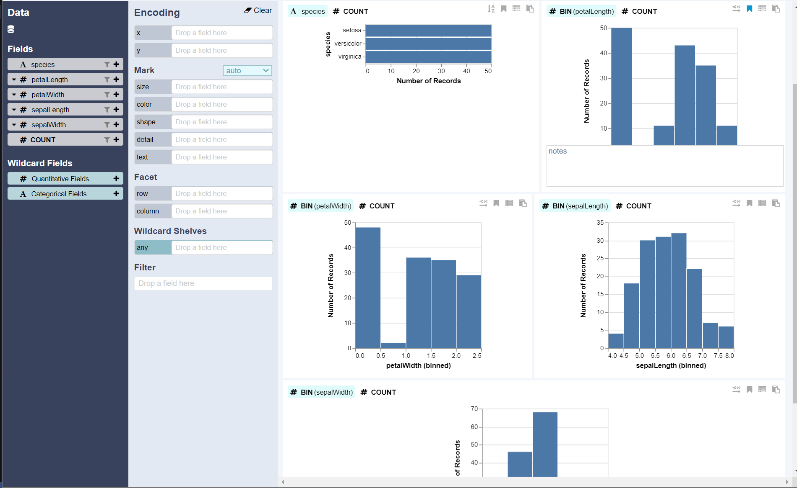
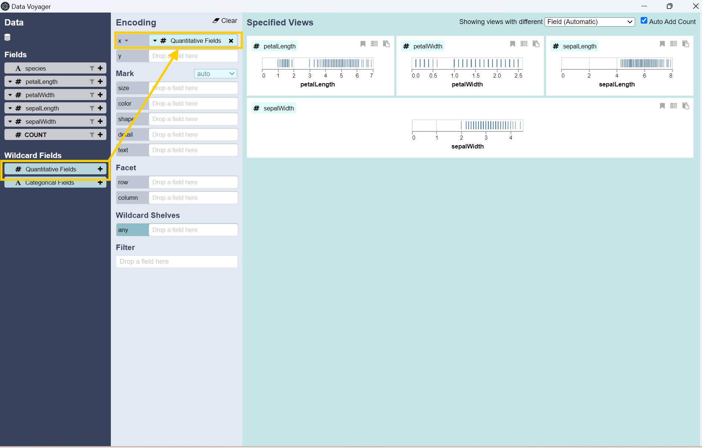
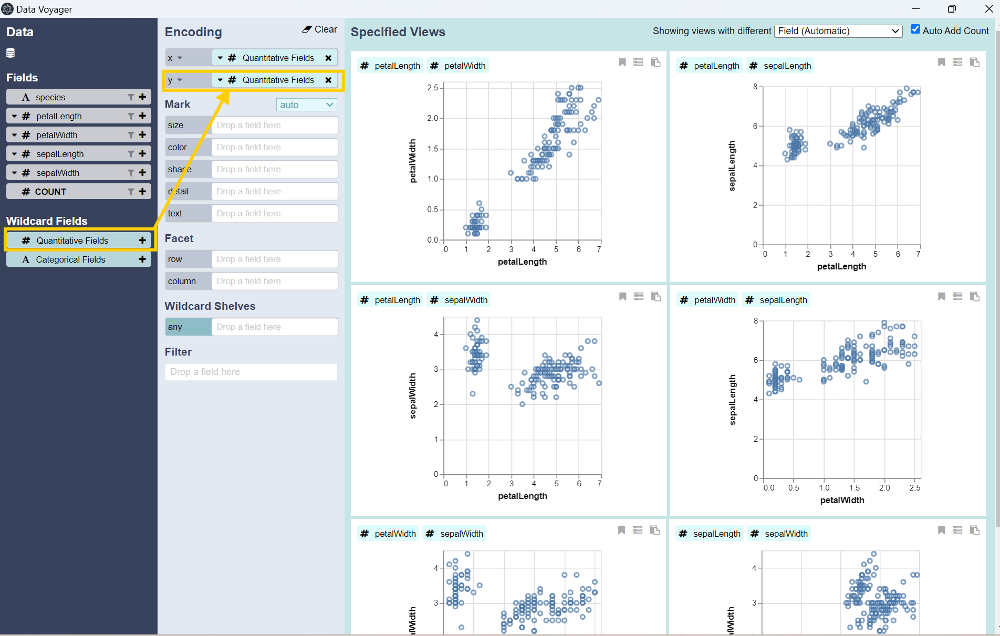
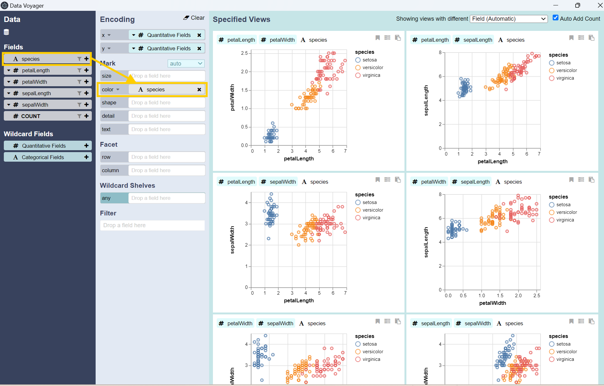

## Data Voyager
DataVoyager has evaluated your data set and is recommending some different polts to help  you explore your data

There is a plot showing that there are 50 records for each of the three species. The rest of the plots are Histograms that show the distribution of the four numeric attributes. This may, or may not, be what you are looking for. Another quick way to explore your data is to drag and drop some of the fields under the Data column and move them to the Encoding column. Start by dragging and dropping the `Quantitative Fields` fileds from the **Wildcard Fields** to the box for the `x`-axis under the Encoding column.

The result is a series of $1$-dimensional Strip Plots. It basically shows the same range for the  data when we looked at in the table. However, in addition, to showing the range, it also shoiws the frequency for each measurement. The darker the line, the higher the frequency, so you can quickly get a sense for where the average measurements might fall. You can choose the `Quantitative Fields` again from the **Wildcard Fields**, but now drag and drop to the `y`-axis box.

Now, you should see several different Scatter Plots comparing 2 different attributes to each other in $2$-diemsional plots. These Scatter Plots are more helpful, since you can easily see the relationship between their attributes. 
1. In the first Plot: As the the Petal gets longer, the Petal gets Wider.
2. In the Second Plot: As the Petal gets longer, the Sepal also gets longer, but with a tighter range.
3. In the Third Plot: As the Petal gets longer, the Sepal Width can theeir be wider or narrower, which is curious. ...

Unlike the first plot, which shows a clear relationship between Petal Length and Petal Width. The relationship beween Sepal Length and Sepal Width is a little more unclear. In order to understand this data better, it would be helpfu; if we could add the Species information to see if there is a difference by Species. You can add a so-called **Third dimension** to these plots by dragged and dropping `species` to the `color` box.

These plots are still technically $2$-D plots but since they display $3$ different attributes, they are sometimes referred to as $3$-dimensional plots. Now, you should see the same $6$ Scatter Plots, but showing the different species in different colors. You can hover over the data points to reveal the actual data. What can we see in this plots?