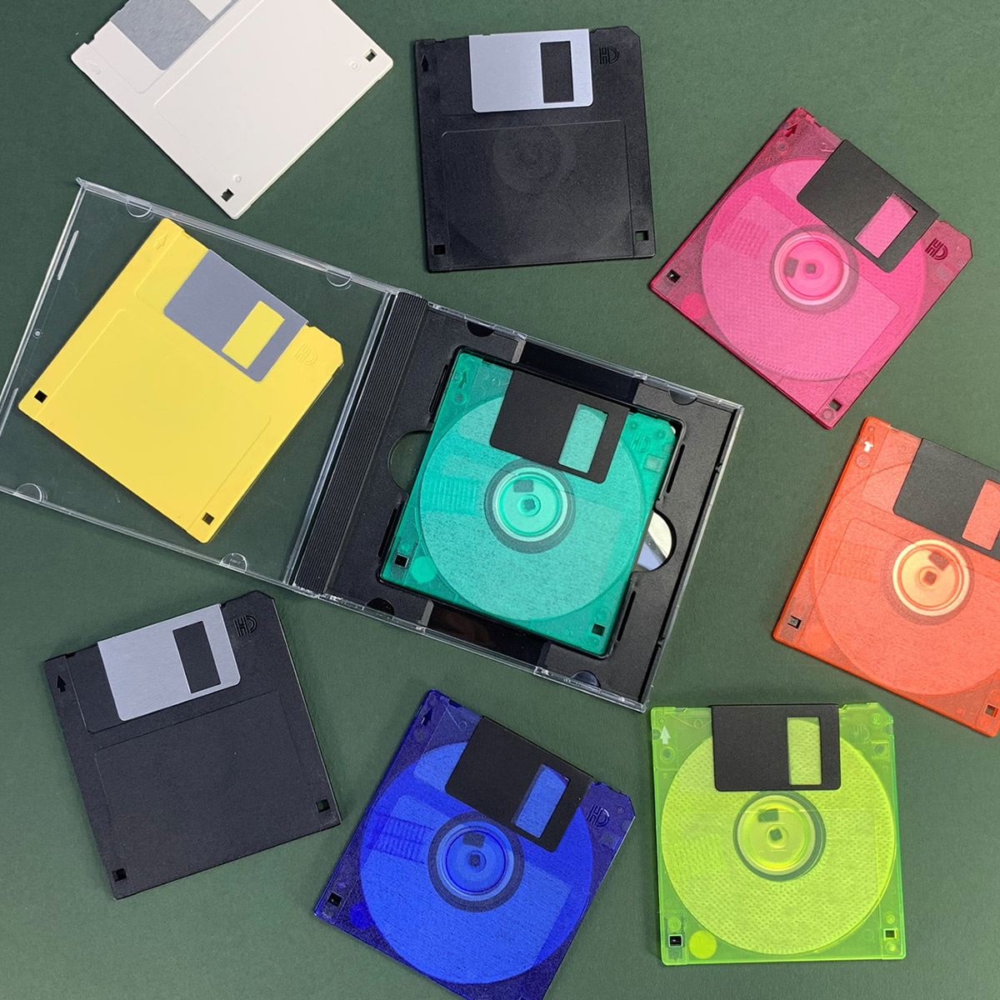

# Analysis and Visualisation using Julia Programming Language

## Introduction

Have you ever seen the movie Johnny Mnemonic? It is a pretty bad movie that came out in 1995. It stars Keanu Reeves before he did The Matrix. It is a science-fiction movie set in the year 2021. It is interesting to see how we imagined the future just a few year ago.In this imaginary world, Keanu Reeves plays a character with a cybernetic brainimplant designed to store information. This brain implant allows him to upload data directly into his brain, and thus allowing him to discretly deliver confidential information that is considered too sensitive to send over the internet. For some reason, this movie is *very* specific about the storage capacity of his brain implant. According to the movie, his brain implant has a storage capacity of 80 gigabytes. In order to accept one final, shady deal, he gets an upgrade, which doubles his capacity to 160 gigabytes. Unfortunately, he finds out that the amount of data he needs to carry is 320 gigabytes, so the overflow data is leaking from his implant directly into his brain, causing severe pain. And, unless he can extract the data within a few days, he...will die.

1995 was the dawn of the internet. Google will be founded three years later in 1998. YouTube would be founded 10 years later in 2005. Back in 1995, 320 gigabytes of portable data was considered enormous -- suitable only for bad science fiction movies. In the 1990s, files were shared using a $3-1/2$ inch floppy disk cartridge, which held about 1 megabyte of data.

Today, you can put 1 terabyte of data onto a poratble flash drive, which is 3 times the amound that Keanu Reeves' character was carrying in his brain, and 1 million times the amount that we could store on a floppy disk in the 1990s.

The point being, the amount of data being generated and stored today is accelerating at a pace that was unthinkable just a few years ago. From online purchases to social media interactions, we cannot avoid data in our modern life. Even if you are not a data scientist, you will need to evaluate data at some point, whether it is for work or for personal reasons. hose who can assess the data, will have an advantage. Those who cannot, will be at the mercy of those who can. 

The traditional tools used to evaluate the data, like spreadsheets, are no longer sufficient to handle the volume, the variety or velocity of data that surround us today. Both professionals and private citizens need to learn a programming language that is capable of analyzing complex data sets for their own peace of mind. Regardless,if the source of the data is your employer, your government or the media, you should never trust curated statisticsat face value. 
> [!TIP]
> Instead, you should try to find the raw data and learn how to perform your own analysis, so you can come to your own conclusions.

If you are new to Analysis, Julia is a great place to begin. This is not a "Julia" lecture.  We are assuming that you have a basic understanding of Julia syntax and semantics. We will not be doing a lot of programming in this lecture. Instead, we will be using a lot of different Julia Packages to help us with our analysis. However, a general understanding of how Julia works **is** required.

If you would like an overview of Julia's Data Analysis Tools Ecosystems, watch David Anthiff's video on the subject[^1]. If you would like a comprehensive tutorial series specifically for data Scientists, watch Huda Nassar's video series[^2]. If you just want to learn how to use the DataFrames Package, watchbogumił kamiński's video series[^3]. However, if you have a basic understanding of Julia and have never done any analysis, then this lecture is for you.

## Iris Flower Data Set
The Iris Flower Data Set is like the "Hello, World!" of Data Analysis lectures. The Iris Flower Data Set is from 1936 paper by the British statitician and geneticist Sir Ronald Fisher.

 The actual measurements were recorded by Edgar Anderson,who was an American botanist working with Ronald Fisher and some others under a followship 1929. The data set is sometimes referred to as either Fisher's Iris data set, or Anderson's Iris data set. Ronald Fisher had some controversial personal views, which have resurfaced in recent years. We will not say any more nore about it, other than to stata a disclaimer that us use the Iris data set in no way endorses the opinion of Ronald Fisher. We are only using the Iris data set because it is a widely used data set to introduce the subject of **Computational Analysis**. 
 The data set contains 150 records under 5 attributes: Sepal Length, Sepal Width, Petal Length, Petal Width and Species. There are 3 species of the Iris Flower that are recorded in this data set: Setosa, Versiclor and Virginica. There are 50 records for each species. Most people know what a flower petal is, but a flower sepal is not commonly known. 

 

> [!TIP]
> The petal is the part that points up, while the sepal is the part that falls down. 

Based on this data set, Ronald Fisher developed a statistical model so that he could classify the different species given just 4 measurements without actually having to see the physical flower. Like "Hello, World!", working on the Iris data set provides a non-scientific, qualitative way to evaluate how easy or how difficult ti is to perform ananlysis using a particular programming language. If it is easy to perform analysis on the Iris data set in that language, then it is a sign that it may be easy to perform analysis on other data sets as well. Conversely, if it is difficult to perform analysis on the Iris data set in that language, then it may be a red flag that performing analysis in that language may be difficult ofr other dta sets as well. 

Let us jump into VS Code and perform our own analysis on the Iris data sety using Julia

### Visualisation of Iris dataset

[^1]: [Here is the link to watch David Anthiff's video](https://www.youtube.com/watch?v=2oXSA2w-p28)
[^2]: [Here is the link to watch Huda Nassar's video series](https://www.youtube.com/playlist?list=PLP8iPy9hna6QuDTt11Xxonnfal91JhqjO&si=VX9Tw-L1A8kLHdJe)
[^3]: [Here is the link to watch bogumił kamiński's video  series](https://www.youtube.com/playlist?list=PLP8iPy9hna6SGnG3FcHlYhdWWrZE7nNEx&si=NoO5l1qQb-fURWvM)

